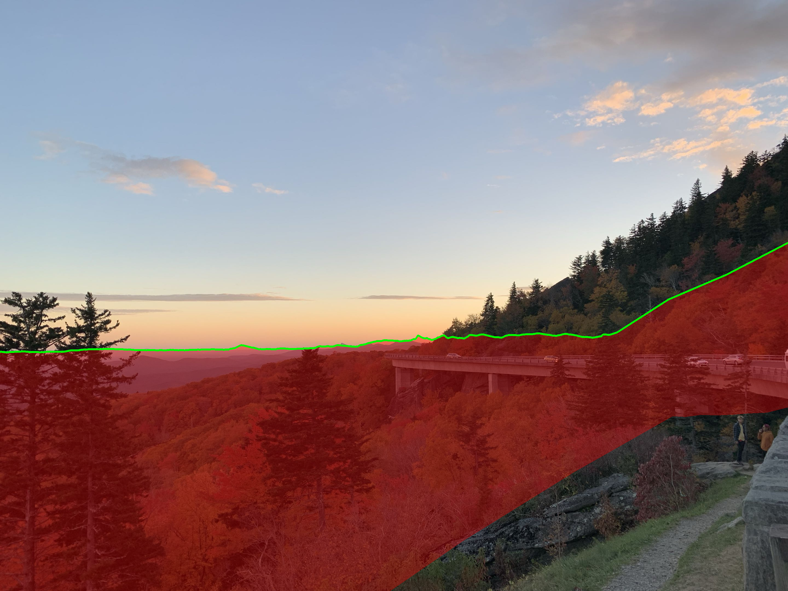
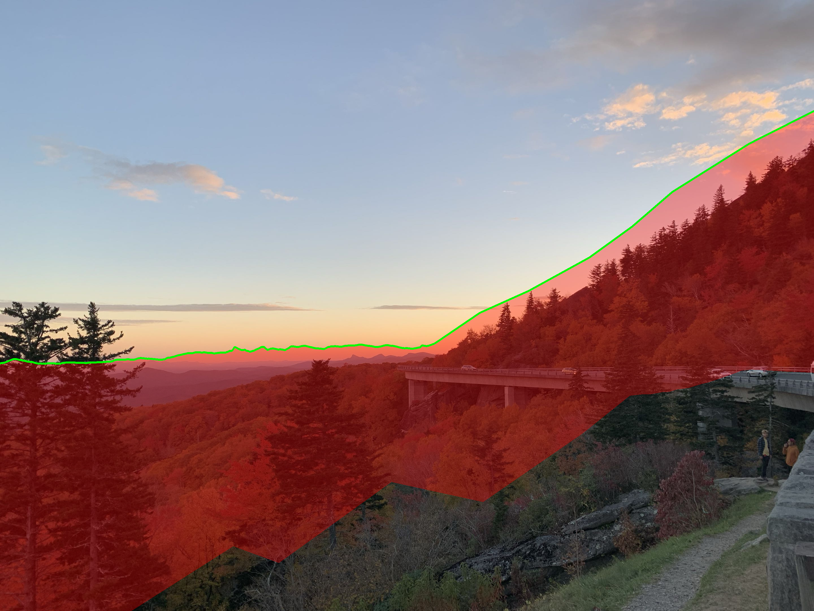
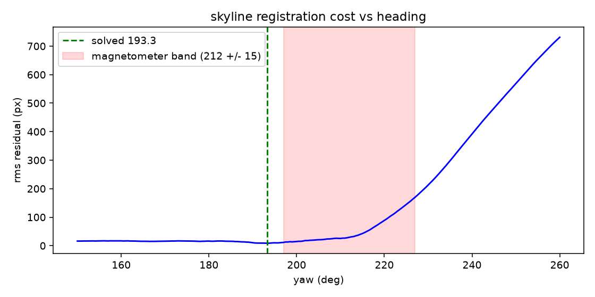

# alpine-ar-overlay

registering a rendered terrain skyline against real photographs to
measure and correct the heading error that breaks naive gps+compass
ar overlays

## the problem

a phone knows position (gps, ~5 m), pitch and roll (accelerometer,
~1 deg) — but heading comes from the magnetometer, good to only
5-15 deg. at 500 m range, 5 deg of heading error puts an overlay
marker 44 m sideways

## the fix

render the skyline a dem predicts, match it against the ridgeline in
the photo, solve for the heading that aligns them

*dem skyline (green) at the solved heading, 193.3 deg*

*same pipeline at a magnetometer-plausible 212 deg*

## results (single photo, blue ridge parkway nc)

- solved heading 193.3 deg vs 212 deg naive guess: **~19 deg correction**
- rms skyline residual **8.45 px = 0.233 deg** against 29 hand-clicked
  far-ridge points
- full 110-deg cost sweep: unique minimum, 11 s (openmp, 16 threads)
- **found limit 1**: bare-earth dems fail for near-field registration
  in forest — tree canopy (~25 m here) shifts the apparent ridge ~3.6 deg
  at 400 m. position and roll freedom were tested and ruled out
- **found limit 2**: heading discrimination scales with ridge relief.
  this low-relief appalachian skyline gives a flat cost plateau to the
  west; alpine relief is the favorable case

full numbers: [docs/results.md](docs/results.md)

## build

    sudo apt install libopencv-dev libgdal-dev
    mkdir build && cd build && cmake .. && make

## tools

- `overlay` — dem + photo + pose -> skyline overlay png
- `pick` — click ridge correspondences in a photo
- `fit_yaw` — heading solver with full cost-landscape sweep
- `export_web` + `web/viewer.html` — interactive 3d pose tuner (three.js)
- `mesh_info` — dem diagnostic

## data

copernicus glo-30 / usgs 3dep via opentopography. dem enu frame is
anchored at the camera's surveyed lon/lat, not the grid center

## license

mit — see [LICENSE](LICENSE). terrain data carries its own (open) terms:
copernicus glo-30 and usgs 3dep
